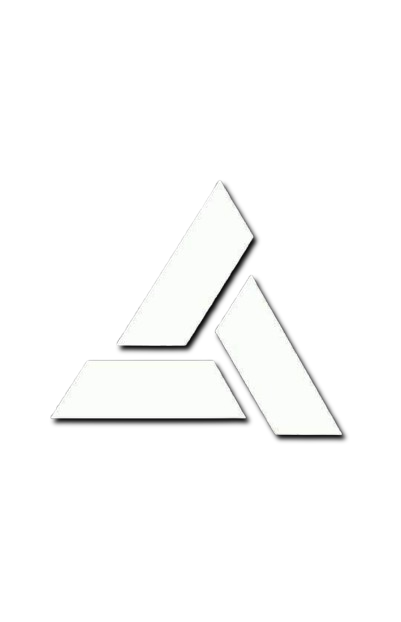

# Unified Game Engine (UGE)



> **Unity-style ease of use** + **Godot-level lightweight performance** + **Unreal-style power** + **Blender-like modeling ambitions**

---

## 🚀 Vision
UGE aims to combine the best of modern game engines:
- **Unity-style ease of use**: GameObject + AddComponent workflow, beginner-friendly.
- **Godot-level lightweight performance**: Runs on 10-20 year old low-end PCs (integrated GPUs, 4GB RAM, dual-core CPUs like Intel Core 2 Duo / i5-3230M).
- **Unreal-style power**: Blueprint visual scripting, Animation Blueprint state machines.
- **Blender-like modeling ambitions**: Long-term goal (deprioritized; glTF/OBJ import first).

---

## 🎯 Target Audience
- **Beginners to advanced users**
- **2D and 3D game development**
- **Easy-to-use inbuilt code editor**

---

## 🛠️ Tech Stack
| Category          | Technology               |
|-------------------|--------------------------|
| **Language**      | C++17                    |
| **Renderer**      | OpenGL 3.3 Core Profile  |
| **Windowing**     | GLFW                     |
| **OpenGL Loader** | GLEW                     |
| **Math**          | GLM (header-only)        |
| **Scripting**     | Lua (sol2, header-only)  |
| **Physics**       | Bullet (3D) + Box2D (2D) |
| **Editor UI**     | Dear ImGui                |
| **Visual Scripting** | imnodes (node editor) |
| **Architecture**  | Custom ECS               |
| **Build System**  | CMake                    |
| **Platforms**     | Windows (MSYS2/MinGW), Linux (Zorin OS/Ubuntu) |

---

## 📦 Already Built (v0.1 + v0.2)
- **Core**: `Window.h/.cpp` (GLFW + OpenGL 3.3 context)
- **ECS**:
  - `Entity.h` (Entity = `uint32_t`)
  - `Registry.h` (CreateEntity, AddComponent, GetComponent, HasComponent, RemoveComponent, View, DestroyEntity)
  - `Components/Transform.h` (Position/Rotation/Scale)
  - `Components/ScriptComponent.h` (ScriptPath, Loaded, LastWriteTime)
- **Scripting**:
  - `ScriptEngine.h/.cpp` (sol2 state, Lua bindings for Transform/Vec3, hot-reload)
- **Main**: `main.cpp` (60Hz fixed-timestep game loop, demo entity with Transform + ScriptComponent)
- **Build**: `CMakeLists.txt` (system GLFW/GLEW/GLM/Lua5.4 via pkg-config, vendored sol2)

---

## 📁 Repository Structure

Unified-Game-Engine/
├── assets/                  # Logo, icons, etc.
│   └── uge-logo.png         # Engine logo
├── src/                     # Core source code
│   ├── Core/
│   │   ├── Window.h
│   │   └── Window.cpp
│   ├── ECS/
│   │   ├── Entity.h
│   │   ├── Registry.h
│   │   └── Components/
│   │       ├── Transform.h
│   │       └── ScriptComponent.h
│   ├── Scripting/
│   │   ├── ScriptEngine.h
│   │   └── ScriptEngine.cpp
│   └── main.cpp
├── third_party/              # Vendored dependencies
│   └── sol/                  # sol2 (Lua bindings)
├── .github/
│   └── workflows/
│       └── cmake-build.yml   # CI for Windows/Linux
├── CMakeLists.txt            # Root CMake file
├── README.md                 # This file
└── LICENSE                   # MIT License


---

## 🔧 Building UGE
### Prerequisites
- **CMake** (≥ 3.10)
- **C++17** compiler (GCC, Clang, or MSVC)
- **Dependencies**:
  - GLFW
  - GLEW
  - GLM
  - Lua 5.4

### Linux (Zorin OS/Ubuntu)
```bash
# Install dependencies
sudo apt update
sudo apt install -y cmake g++ pkg-config libglfw3-dev libglew-dev liblua5.4-dev

# Clone and build
git clone https://github.com/shivamcodeing/Unified-Game-Engine.git
cd Unified-Game-Engine
mkdir build && cd build
cmake .. -DCMAKE_BUILD_TYPE=Release
make -j\$(nproc)

# Windows (MSYS2/MinGW)

# Install dependencies via MSYS2
pacman -S --needed cmake mingw-w64-x86_64-gcc mingw-w64-x86_64-glfw mingw-w64-x86_64-glew mingw-w64-x86_64-lua

# Clone and build
git clone https://github.com/shivamcodeing/Unified-Game-Engine.git
cd Unified-Game-Engine
mkdir build && cd build
cmake .. -G "MinGW Makefiles" -DCMAKE_BUILD_TYPE=Release
mingw32-make -j\$(nproc)

# 🤝 Contributing

Contributions are welcome! Open an issue or submit a pull request.

# 📜 License
This project is licensed under the MIT License – see LICENSE for details.


---

#### **3. GitHub Actions CI Workflow**
Create the directory `.github/workflows/` and add a file named `cmake-build.yml` with the following content:

```yaml
name: CMake Build

on:
  push:
    branches: [ main ]
  pull_request:
    branches: [ main ]

jobs:
  build:
    runs-on: ${{ matrix.os }}
    strategy:
      matrix:
        os: [ubuntu-latest, windows-latest]

    steps:
    - uses: actions/checkout@v4

    - name: Install dependencies (Linux)
      if: matrix.os == 'ubuntu-latest'
      run: |
        sudo apt update
        sudo apt install -y cmake g++ pkg-config libglfw3-dev libglew-dev liblua5.4-dev

    - name: Install dependencies (Windows)
      if: matrix.os == 'windows-latest'
      run: |
        choco install -y cmake mingw
        # Note: For Windows, you may need to manually install GLFW, GLEW, and Lua via vcpkg or other package managers.
        # This is a placeholder; adjust as needed for your environment.

    - name: Configure CMake
      run: |
        mkdir build
        cd build
        cmake .. -DCMAKE_BUILD_TYPE=Release

    - name: Build
      run: |
        cd build
        cmake --build . --config Release --parallel